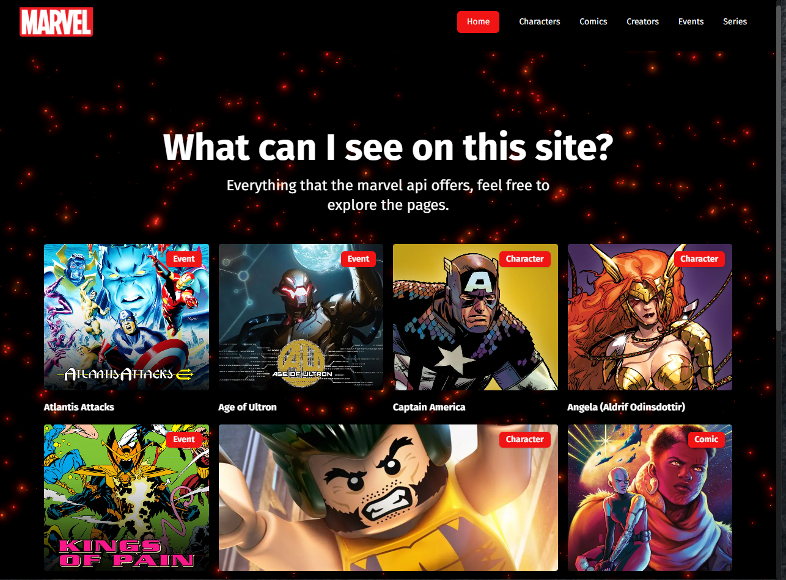

# Marvel App

### Visível em: https://marvel.caiosouza.dev

Este projeto é um aplicativo desenvolvido com Next.js 14, React Query, Tailwind CSS, TypeScript e Shadcn UI.
Ele utiliza a API da Marvel para exibir informações sobre personagens, quadrinhos e outros dados relacionados ao universo Marvel.

 As rotas dinâmicas são utilizadas para acessar detalhes específicos através de IDs.

## Tecnologias Utilizadas

- **Next.js 14**: Framework React para desenvolvimento de aplicações web.
- **React Query**: Biblioteca para gerenciamento de estado assíncrono.
- **Tailwind CSS**: Framework CSS utilitário para estilização.
- **TypeScript**: Superset de JavaScript que adiciona tipagem estática.
- **Shadcn UI**: Biblioteca de componentes UI.
- **API da Marvel**: Fonte de dados para informações sobre o universo Marvel.

## Funcionalidades

- Listagem de personagens, quadrinhos, séries, etc.
- Detalhes de personagens com rotas dinâmicas.
- Pesquisa por personagens e quadrinhos.
- Navegação intuitiva e interface responsiva.

## Rotas do Projeto

Route (app)                              
┌ ○ /                                    
├ ○ /_not-found                                
├ ƒ /character/**[id]**                      
├ ○ /characters                          
├ ƒ /comic/**[id]**                          
├ ○ /comics                              
├ ○ /creators                            
├ ƒ /event/**[id]**                          
├ ○ /events                              
├ ƒ /serie/**[id]**                          
└ ○ /series 